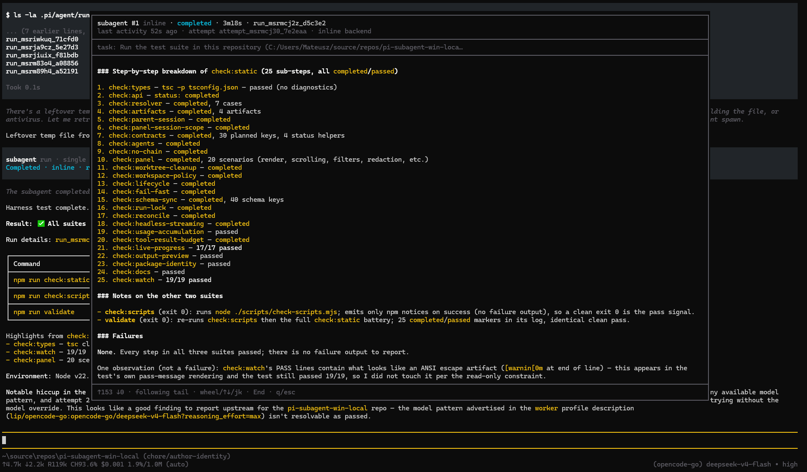

# pi-delegator

**Delegate tasks to subagent workers in [Pi](https://pi.dev) — run them in parallel, in the background, or in isolated sandboxes.**

[](https://github.com/matdev83/pi-delegator/actions/workflows/ci.yml)

---

## TL;DR

`pi-delegator` adds a subagent delegation runtime to Pi. Instead of doing everything sequentially in your main conversation, you can ask Pi to spin up **subagent workers** — separate, lightweight sessions that work on tasks independently.

- ⚡ **Parallel execution** — fan out multiple tasks simultaneously and aggregate the results
- ⏳ **Background / async runs** — launch long-running tasks in the background and continue chatting
- 🔒 **Sandboxed execution** — run untrusted code or tests with strict network and filesystem boundaries
- 🌿 **Git worktrees** — give each worker its own isolated branch and working copy so parallel edits never collide
- 📊 **Live observability** — monitor worker status in real time with an interactive TUI panel or pop-up watch modal
- 💻 **Cross-platform** — full support for Linux, macOS, and native Windows

Install with one command:

```bash
pi install git:github.com/matdev83/pi-delegator
```


*Live subagent watch modal showing real-time output and status.*

---

## Installation

### Requirements

| Requirement | Supported version | Notes |
|---|---|---|
| **Pi** | v1.x (`1.*`) | Upstream Pi harness v1 series required |
| **Node.js** | `>= 22.19.0` | Runtime environment for Pi and extensions |

**Backward compatibility with pre-v1 Pi releases will not be maintained.**
Upgrade to the Pi v1.x series before installing or updating this plugin.

SDK selection preserves the live harness for inline runs and pins a disk-backed
SDK for detached workers. Standalone API callers prefer their installed runtime
SDK over global `PATH` discovery. For relocated or compiled/embedded hosts without
a discoverable matching disk installation, set `PI_DELEGATOR_SDK_ROOT` to the
matching SDK package root. See [Pi SDK resolution](./docs/usage.md#pi-sdk-resolution)
for precedence, CLI selection, and Windows MSYS-path support.

### Install the plugin

Run the following command inside your terminal:

```bash
pi install git:github.com/matdev83/pi-delegator
```

Then **reload Pi** (run `/reload` or restart your session) to activate the extension.

To track the default branch explicitly:

```bash
pi install git:github.com/matdev83/pi-delegator@main
```

For pinned, reproducible installations, replace `@main` with a release tag (e.g. `@v0.1.0`) or a specific commit hash.

> [!NOTE]
> The package is currently distributed via GitHub, so no npm account or setup is required.
> When the package is published to the public registry, installation via npm will also be supported:
> ```bash
> pi install npm:pi-delegator
> ```

### Platform support

| Platform | Out of the box | Visible live workers |
|---|---|---|
| **Linux / macOS** | Supported (`inline`, `headless`) | Supported via **`tmux`** (ensure `tmux` is on your `PATH`) |
| **Windows (native)** | Supported (`inline`, `headless`) | Supported via **`herdr`** (see below) |
| **Windows (WSL2)** | Supported | Supported via **`tmux`** inside the WSL2 environment |

#### Windows: visible workers with Herdr

Native Windows runs using the `inline` and `headless` backends work out of the box with zero external dependencies.

If you want **visible interactive workers** on native Windows, install **[Herdr](https://herdr.dev)** (a terminal workspace manager built for agentic workflows):

```powershell
powershell -ExecutionPolicy Bypass -c "irm https://herdr.dev/install.ps1 | iex"
```

Restart your terminal if necessary, then verify that Herdr is installed and the server is running:

```powershell
herdr --version
herdr status
```

If `herdr status` reports no running server, launch one by running `herdr` in a separate terminal. For troubleshooting and beta details, consult the [Herdr installation guide](https://herdr.dev/docs/install/).

### Migrating from `@agwab/pi-subagent`

If you have the legacy `@agwab/pi-subagent` package installed, **remove or disable it** before installing `pi-delegator`. Both extensions register the `subagent` tool and `/subagent` slash command namespace.

Your existing run history, logs, and `.pi-subagent-worktrees` directories remain intact and readable. New configuration should use `PI_DELEGATOR_*` environment variables (legacy `PI_SUBAGENT_*` variables remain supported as fallbacks).

---

## How to use

Once installed, Pi automatically knows how to delegate tasks using the `subagent` tool whenever appropriate. You can simply prompt Pi in natural language:

### Prompt examples

- **Single delegated task:**
  ```text
  Review this git diff for potential security vulnerabilities using a subagent.
  ```
- **Parallel fan-out:**
  ```text
  Run three reviewers in parallel for this PR:
  1. Security audit
  2. Performance & memory benchmarks
  3. Unit test coverage gaps
  ```
- **Background / asynchronous work:**
  ```text
  Start a background audit of the dependencies and notify me when it finishes.
  ```
- **Isolated sandbox execution:**
  ```text
  Run the test suite in a sandboxed worker with no network access and report the artifacts.
  ```
- **Worktree isolation for code changes:**
  ```text
  Implement the refactor in an isolated git worktree so my current working tree isn't modified.
  ```

---

## Slash commands & shortcuts

`pi-delegator` provides a dedicated `/subagent` command family to manage, inspect, and interact with running workers:

| Command | Description | When to use |
|---|---|---|
| `/subagent panel` | Opens the full-screen interactive TUI dashboard. | Use whenever you want an overview of active runs, elapsed times, historical attempts, and recent logs. |
| `/subagent watch [number\|runId]` | Opens a live modal watching a worker's streaming output. | Use to inspect what a specific worker is currently doing (e.g. `/subagent watch 1` for worker #1). Press `q` or `Esc` to exit. |
| `/subagent kill [runId]` | Cancels an active subagent run. | Use to abort a runaway worker. If only one worker is active, the `runId` argument is optional. |
| `/subagent kill all` | Cancels all active workers in the current session. | Emergency stop to terminate all running subagents at once. |
| `/subagent enable` | Enables the `subagent` tool for the current session. | Re-enables subagent capabilities if previously disabled (enabled by default). |
| `/subagent disable` | Hides the `subagent` tool from the model. | Use when you want Pi to solve everything directly without delegating to subagents. |

### Keyboard shortcuts

While focused on Pi's message input box:

| Shortcut | Action |
|---|---|
| `Alt+Shift+1` … `Alt+Shift+9` | Instantly open the watch modal for worker `#1` through `#9` |
| `Ctrl+Shift+1` … `Ctrl+Shift+9` | Fallback shortcut for terminals that capture or block `Alt+Shift` |
| `Ctrl+Shift+U` | Jump directly to the most recently active worker |

---

## Subagent modes (backends)

Every worker runs inside an execution backend. You can let Pi pick automatically or request a specific backend in your prompt.

### Comparison at a glance

| Backend | Process model | Visible terminal? | Sandboxing? | Platforms | Best for |
|---|---|---|---|---|---|
| **`inline`** (default) | Current Pi process | ❌ No | ❌ No | All | Fast, lightweight tasks where startup latency matters |
| **`headless`** | Child process (`pi --mode json`) | ❌ No | ✅ Yes | All | Sandboxed runs, heavy tasks, or extension-provided models |
| **`tmux`** | Detached `tmux` session | ✅ Yes | ✅ Yes | Linux, macOS | Interactive oversight when you want to watch the terminal |
| **`herdr`** | Managed `herdr` workspace pane | ✅ Yes | ✅ Yes | Windows, Linux, macOS | Live terminal visibility on Windows, or multi-pane terminal setups |

---

### Detailed backend guide & hints

#### 1. `inline` — Fast in-process execution

The `inline` backend runs synchronous subagents inside the existing Pi process using the Pi SDK.

With `async: true`, a detached Node worker owns the inline SDK session. It avoids
a separate Pi CLI process, but still requires a child worker process.

- **Pros:** Synchronous runs avoid process-spawning overhead.
- **Trade-offs:** Runs without OS-level sandboxing; terminal output is captured but not displayed in an external window.
- 💡 **Hint:** Ideal for quick reviews, code explanations, small generation tasks, and read-only queries where speed is the priority.

#### 2. `headless` — Isolated background process

The `headless` backend spawns an independent background Pi process running in JSON mode.

- **Pros:** Full process isolation; supports OS sandboxing; automatically loads ambient Pi extensions and skills (essential if your LLM provider is registered via a custom extension, such as Cursor ACP).
- **Trade-offs:** Slightly higher startup latency than `inline`.
- 💡 **Hint:** Use this whenever you enable sandboxing, run untrusted shell commands, or use custom model providers from third-party extensions.

#### 3. `tmux` — Live terminal session (Linux & macOS)

The `tmux` backend launches the worker inside a detached `tmux` window or session.

- **Pros:** Full visual feedback — you can attach to the session or view streaming progress live via `/subagent watch`.
- **Trade-offs:** Requires `tmux` installed; not available on native Windows (unless using WSL2).
- 💡 **Hint:** Choose this when executing complex build steps, interactive test suites, or long tasks where you want to watch output as it streams.

#### 4. `herdr` — Terminal workspace manager (Windows & cross-platform)

The `herdr` backend orchestrates workers within [Herdr](https://herdr.dev) tabs and panes.

- **Pros:** The premier visible backend for native Windows; provides structured multi-pane session management on Windows, Linux, and macOS.
- **Trade-offs:** Requires the external `herdr` CLI tool and a running Herdr server.
- 💡 **Hint:** The recommended choice if you are on Windows and want live visible workers, or if you prefer Herdr's agent-oriented workspace layout over tmux.

---

### Automatic backend selection

When you don't explicitly specify a backend, `pi-delegator` automatically chooses the best one:

| Scenario / Prompt request | Chosen backend |
|---|---|
| Requesting live visibility (`visible: true`) | `tmux`; on native Windows, explicitly request `backend: "herdr"` |
| Requesting a sandbox (`sandbox: true` or *"sandboxed"*) | `headless` |
| Standard task delegation | `inline` |

To override automatic selection, simply specify your preference:
```text
Run the benchmark script using the headless backend in an isolated worktree.
```

---

## Core features

### 🔒 Sandbox isolation

Workers can execute inside an OS-level sandbox with restricted permissions. By default, sandboxed workers have **no network access**.

If your task needs access to specific APIs (such as the model provider's endpoint or a package registry), you can specify allowed domains:

```text
Run this task in a sandboxed worker, allowing outbound access only to api.anthropic.com and registry.npmjs.org.
```

### 🌿 Git worktrees

When running multiple mutating workers concurrently, asking them to write to the same working directory can cause race conditions and merge conflicts.

Enabling `worktree: true` instructs the plugin to provision a temporary, dedicated Git worktree for each worker. When the task completes, results and patches are cleanly reported.

```text
Run two implementation approaches in parallel, each in its own git worktree.
```

### 👥 Custom agent profiles

Define specialized worker roles with markdown profiles stored in:
- Global agents: `~/.pi/agent/agents/*.md`
- Project agents: `.pi/agents/*.md`

Profiles can define custom system prompts, tool ceilings, and default models:

An explicit call/task `model` wins over the profile model. If neither names a
model, Pi tool runs inherit the parent session's current model, including
agentless, parallel, and async runs. Standalone API calls without a parent model
retain SDK/settings defaults unless a model is supplied.

Inline sessions use their own model runtime: inheriting a model identifier does
not transfer extension-provided provider registration or credentials. Empty-output
errors identify the selected model and suggest a built-in authenticated provider
or the `headless` backend, which can load provider extensions in a child Pi process.

```text
Delegate the API security review to the security-auditor agent.
```

### ⏱️ Inactivity guards & timeouts

To prevent forgotten or stalled background tasks from running indefinitely, workers include a **15-minute inactivity watchdog**. If a worker produces no tool calls, logs, or process activity for 15 minutes, it is cleanly halted.

---

## Further documentation

For orchestrators, code integration, and deep configuration options:
- [Usage Reference & Developer API](./docs/usage.md) — complete reference of schema arguments, TypeScript SDK methods (`runSubagent`, `getSubagentStatus`), artifact paths, and environment variables.
- [Project Attribution & Provenance](./NOTICE.md) — upstream history and acknowledgments.
- [Changelog](./CHANGELOG.md) — release notes and version history.

---

## Attribution & License

`pi-delegator` is an independently maintained derivative of [`@agwab/pi-subagent`](https://github.com/AgwaB/pi-subagent) by AgwaB (based on upstream `v0.4.8`), released under the [MIT License](./LICENSE). It is not affiliated with or endorsed by the original upstream project.
